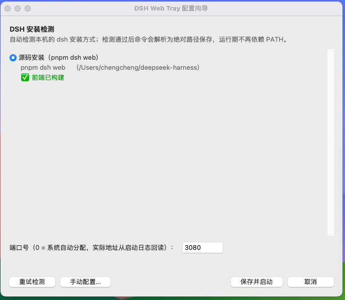

# DSH Web Tray

把 DSH Web GUI 装进系统托盘：双击启动、后台运行、不占终端、状态一眼可见。


[](https://github.com/crocketc/dsh-web-tray/releases/latest)
[](https://github.com/crocketc/dsh-web-tray/releases/latest)

## 它解决什么问题

直接在终端里跑 `dsh web` 有几个日常烦恼：

- **占一个终端窗口**——关掉窗口，服务就停了
- **看不出它活没活着**——端口多少、地址是什么，都得翻终端输出
- **每次开机要手动敲命令**

DSH Web Tray 把它变成一个"托盘小服务"：

| 你得到的 | 说明 |
|---------|------|
| 🖱️ 双击启动 | 无终端窗口，后台静默运行 |
| 🎨 状态一眼可见 | 托盘图标颜色实时反映运行状态，悬停显示访问地址 |
| 🌐 一键打开浏览器 | 双击托盘图标即可打开 Web 界面（自动带正确端口） |
| 💥 崩溃自动感知 | dsh 意外退出时图标变红，一键重启 |
| 🔁 防重复启动 | 检测到已在运行的实例会显示"外部启动"，不会起第二份 |
| ⏻ 干净退出 | 从托盘退出时**只关自己启动的** dsh，不碰外部进程，不留孤儿进程 |
| 💾 可选开机自启 | 托盘菜单上勾一下就行 |

## 安装

### 方式一：下载安装包（推荐）

去 [Releases 页面](https://github.com/crocketc/dsh-web-tray/releases/latest) 下载对应平台的包：

| 下载文件 | 适用平台 | 怎么用 |
|---------|---------|--------|
| `dsh-web-tray.exe` | Windows | 下载后双击即用 |
| `dsh-web-tray-arm64-*.dmg` | Mac（M 系列芯片） | 打开 DMG，把应用拖到里面的「应用程序」快捷方式 |
| `dsh-web-tray-x86_64-*.dmg` | Mac（Intel 芯片） | 同上 |

**无需安装 Python 或任何依赖。**

> - Windows 首次运行 exe 可能弹 SmartScreen 蓝色警告（未购买代码签名证书的通病）：点"更多信息" → "仍要运行"
> - Mac 首次打开需**右键点应用 → 打开**（同理，未做 Apple 公证）；它只出现在菜单栏，不占 Dock

### 方式二：从源码运行

需要 Python 3.9+：

```bash
pip install -r requirements.txt

# Windows：双击 start-tray.cmd（后台运行，关终端无影响）
# 或命令行：
pythonw dsh-web-tray.py     # 后台
python dsh-web-tray.py      # 前台（调试用，能看输出）
```

```bash
# macOS（Homebrew Python 需先装 tk）
brew install python-tk
pip3 install -r requirements.txt
python3 dsh-web-tray.py
```

## 首次运行

第一次启动会弹出**配置向导**，全程只需点几下：



1. 自动检测本机的 dsh 安装（npm 全局 / 源码 pnpm / npx 本地，多份共存时让你选）
2. 选端口号（默认 3080；填 0 = 每次自动分配）
3. 保存后自动启动，托盘出现图标

没装 dsh？向导会给出安装命令（可一键复制）和官方文档链接，装好后点"重试检测"即可。

## 日常使用

### 托盘图标 = 状态灯

| 图标 | 状态 | 含义 |
|------|------|------|
| 🔵 蓝色 | 启动中 | 正在拉起 dsh web（首次启动含初始化，可能要等十几秒） |
| 🟢 绿色 | 运行中 | 服务正常，悬停图标可看访问地址 |
| 🩵 青色（双环） | 运行中·外部启动 | 检测到你自己在外部启动的 dsh（比如终端里跑的），托盘只监控、不接管 |
| 🔴 红色（✕） | 意外退出 / 启动失败 | 前者点"重新启动"；后者看日志排查 |
| ⚪ 灰色 | 已停止 | 点"重新启动"可再次拉起 |

### 右键菜单


```
● 运行中 (http://127.0.0.1:3080)      ← 状态行，实时更新
──────────────────
打开浏览器          ← 也可以直接双击托盘图标
重新启动
停止
☑ 开机自启            ← 勾选框，点一下切换
重新配置            ← 重跑配置向导
──────────────────
帮助
  ├── 如何安装 DSH
  ├── 访问官方文档
  └── 打开日志目录
退出                ← 优雅停止 dsh 并退出托盘
```

### 两个值得知道的行为

- **退出托盘 ≠ 一定杀掉 dsh**：托盘只停掉**自己启动的**那份。如果你在终端里手动跑了一个 dsh web（青色"外部启动"状态），退出托盘不会碰它——避免误杀你正在用的会话
- **换端口 / 换安装方式**：菜单 → 重新配置，向导里改完保存即可

## 常见问题

**双击后托盘没图标？**
Windows 检查是否被 SmartScreen 拦截（见上文）；源码用户确认依赖装了没：`python -c "import pystray, PIL, psutil"`。仍不行就看日志（见下文"文件都在哪"）。

**状态是红色的"启动失败"？**
最常见原因：源码安装的 dsh 没构建前端。去 dsh 仓库根目录执行 `pnpm install && pnpm run build`，然后托盘菜单 → 重新启动。

**一直蓝色"启动中"？**
首次启动要做初始化，等 30-60 秒属正常。超时后会转红并提示看日志。

**显示"外部启动"但我明明没开？**
可能是之前某次手动启动的 dsh 还在后台。想统一交给托盘管理：先停掉那个进程，再托盘菜单 → 重新启动。

**数据都存在哪？**

| 内容 | 位置 |
|------|------|
| 配置 | `~/.dsh-web-tray/config.json`（Windows 即 `C:\Users\你\.dsh-web-tray\`） |
| dsh 运行日志 | `~/.dsh-web-tray/logs/dsh-web.log`（超 5MB 自动轮转） |
| 托盘自身日志 | `~/.dsh-web-tray/logs/tray.log`（排障先看这个） |

菜单"帮助 → 打开日志目录"可以直接跳过去。

## 平台专属说明

- [README-Windows.md](README-Windows.md) — 安装细节、开机自启、Windows 特有行为
- [README-macOS.md](README-macOS.md) — 安装细节、菜单栏使用、首次打开引导

## 技术细节（可选阅读）

好奇内部实现或想参与开发的，这里是速览：

- **就绪判定**：不轮询端口。解析 dsh 官方的 stdout 就绪信号（`dsh web: http://...` URL 行），该行打印时所有 API 路由已挂载完毕；天然支持 `--port 0` 自动分配端口
- **优雅退出**：macOS/Linux 上向 dsh 发 SIGTERM（dsh 官方约定的 supervisor 停止信号，exit 0，dsh 自行清理整棵进程树）；Windows 无法投递 SIGTERM，改用进程树终止 + Job Object 绑定（托盘被强杀时内核自动带走整棵 dsh 树，不留孤儿）
- **macOS GUI 环境的 PATH 陷阱**：双击启动的应用看不到 Homebrew/nvm/volta 装的工具（GUI 进程的 PATH 只有系统目录）。对策是配置保存时即解析为绝对路径（登录 shell + 常见安装目录双路兜底），运行期不依赖 PATH
- **配置存 argv 数组**而非字符串：路径带空格也不会碎；读取兼容 UTF-8 BOM
- **单实例锁**：锁文件 + PID + 进程创建时间三重校验，防误判也防重复启动

测试：50 个单元测试 + 真实 dsh 集成测试（启动→就绪→HTTP 探活→停止→验证无孤儿）：

```bash
python -m unittest discover -s tests
DSH_WEB_TRAY_LIVE=1 python -m unittest tests.test_integration_live -v   # 集成
```

## 许可

随 DSH（DeepSeek Harness）生态使用：<https://github.com/deepseek-ai/harness>
